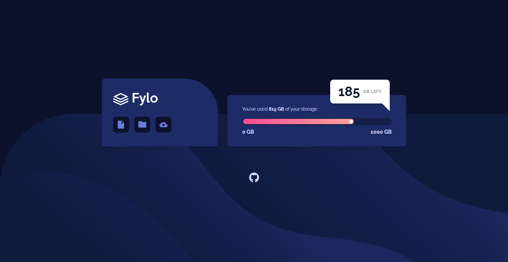

# Fylo Data Storage Component

## Links:
- [Challenge Link](https://www.frontendmentor.io/challenges/fylo-data-storage-component-1dZPRbV5n)
- [Site Preview](https://robinjmm-fylo.vercel.app/)

## About
This is my solution for the Fylo Data Storage Component challenge from [Frontendmentor.io](https://frontendmentor.io).

## User Stories
The user should be able to:
- View the optimal layout depending on their device's screen size.

## Built with
- HTML5
- CSS3
- SASS
- PostCSS
- JavaScript
- Vite

## Acknowledgement
I'm very grateful to the people at [Frontendmentor.io](https://frontendmentor.io) for providing designs and challenges that help me improve my skills as a web developer.
